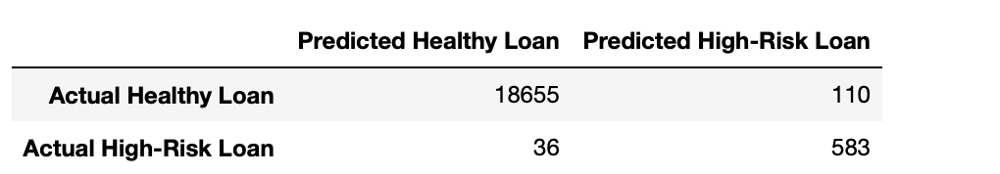
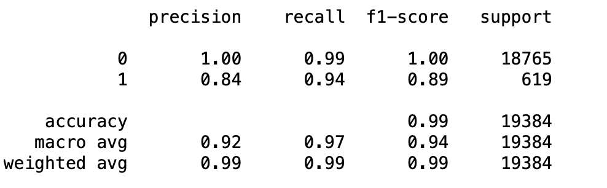
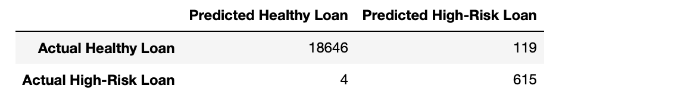
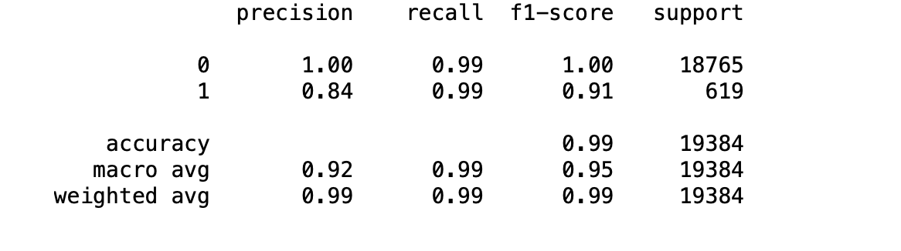

# Credit Risk Classification Analysis

The objective of this analysis is to build a predictive model capable of accurately categorizing loan applicants into two classes: 'healthy loan' and 'high-risk loan'. This categorization is based on a variety of application factors, including loan size, interest rate, borrower income, debt-to-income ratio, number of accounts, pre-defined derogatory marks, with the loan status as the target variable.

The target variable, loan status, was binary, comprising classes for healthy (0) and high-risk (1) loans. The dataset exhibited class imbalance, with a higher prevalence of healthy loans compared to high-risk loans, posing a challenge for accurate model training. To mitigate this issue, we employed logistic regression as our primary classification algorithm and implemented the RandomOverSampler technique. This resampling method artificially balanced the dataset by oversampling the minority class (high-risk loans), thereby improving the model's ability to accurately predict both classes and mitigate the effects of class imbalance.

## Tools Used:
## Libraries for Python Programming

### NumPy
NumPy is a powerful library for numerical operations, specializing in handling large, multi-dimensional arrays and matrices.

### Pandas
Pandas provides data structures and tools for effective data manipulation and analysis in Python.

### Pathlib
Pathlib is a module in Python used for creating and managing filesystem paths in a platform-independent manner.

### Scikit-learn Metrics
Scikit-learn is a popular machine learning library in Python. Here are some important metrics it offers:

- **balanced_accuracy_score**: Measures the balanced accuracy of a model, particularly useful for evaluating performance on imbalanced datasets.
- **confusion_matrix**: Calculates the confusion matrix, which helps in evaluating the accuracy of a classification model.
- **classification_report**: Generates a comprehensive text report showing the main classification metrics on a per-class basis.
## Features
### Data Preparation:
- Read the lending_data.csv file from the Resources folder into a Pandas DataFrame.
- Create labels (y) from the "loan_status" column, where 0 represents a healthy loan and 1 represents a high-risk loan.
- Create features (X) from the remaining columns in the DataFrame.
- Split the data into training and testing datasets using train_test_split.

### Logistic Regression Model Creation:
- Create two logistic regression models: one with the original data and another with resampled data using RandomOverSampler.
- Train the logistic regression models using the training data (X_train and y_train).

### Model Evaluation:
- Make predictions for the testing data labels (y_test) using the testing feature data (X_test) and the fitted models.
- Generate confusion matrices to evaluate the performance of the models.
- Print classification reports to provide detailed metrics such as precision, recall, and F1-score for each class.

### Analysis:
- Analyze the confusion matrices and classification reports to assess how well the logistic regression models predict both healthy (0) and high-risk (1) loans.
- Examine metrics such as accuracy, precision, recall, and F1-score to understand the models' performance on both original and resampled data.
- Note and discuss any differences in performance between the models trained on original and resampled data.
## Report

### Overview of the Analysis
The objective of this analysis is to build a predictive model capable of accurately categorizing loan applicants into two classes: 'healthy loan' and 'high-risk loan'. This categorization is based on a variety of application factors, including loan size, interest rate, borrower income, debt-to-income ratio, number of accounts, pre-defined derogatory marks, with the loan status as the target variable.

The target variable, loan status, was binary, comprising classes for healthy (0) and high-risk (1) loans. The dataset exhibited class imbalance, with a higher prevalence of healthy loans compared to high-risk loans, posing a challenge for accurate model training. To mitigate this issue, we employed logistic regression as our primary classification algorithm and implemented the RandomOverSampler technique. This resampling method artificially balanced the dataset by oversampling the minority class (high-risk loans), thereby improving the model's ability to accurately predict both classes and mitigate the effects of class imbalance.

### Results

**Machine Learning Model 1: Logistic Regression**

- Balanced Accuracy: 96.798%
- Precision for healthy loans (class 0): 1.00
- Recall for healthy loans (class 0): 0.99
- F1-score for healthy loans (class 0): 1.00
- Precision for high-risk loans (class 1): 0.84
- Recall for high-risk loans (class 1): 0.94
- F1-score for high-risk loans (class 1): 0.89

    
    

**Machine Learning Model 2: RandomOverSampler**

- Balanced Accuracy: 99.35%
- Precision for healthy loans (class 0): 1.00
- Recall for healthy loans (class 0): 0.99
- F1-score for healthy loans (class 0): 1.00
- Precision for high-risk loans (class 1): 0.84
- Recall for high-risk loans (class 1): 0.99
- F1-score for high-risk loans (class 1): 0.91
    
    
### Summary

Based on the results of the machine learning models:

* The logistic regression model with RandomOverSampler achieved a slightly higher balanced accuracy of 99.35% compared to the logistic regression model alone, which had a balanced accuracy of 96.798%.
The RandomOverSampler technique notably improved the recall for high-risk loans in the logistic regression model, resulting in a higher F1-score for high-risk loans at 0.91 compared to 0.89 in the logistic regression model alone.
* The choice of model depends on the specific problem we are trying to solve. If accurately identifying both healthy and high-risk loans is paramount, the logistic regression model with RandomOverSampler is recommended due to its superior overall performance, particularly in identifying high-risk loans.
However, if interpretability is more crucial and there is a tolerance for slightly lower performance in identifying high-risk loans, the logistic regression model alone could still be considered a viable option.
In summary, the logistic regression model with RandomOverSampler is recommended for its enhanced performance in accurately predicting both healthy and high-risk loans. However, the choice ultimately depends on the priorities and constraints of the problem at hand.
## Data sources:

Here's the information about the lending_data.csv file in list format.
- loan_size: The size of the loan.
- interest_rate: The interest rate of the loan.
- borrower_income: Income of the borrower.
- debt_to_income: Debt-to-income ratio of the borrower.
- num_of_accounts: Number of accounts held by the borrower.
- derogatory_marks: Number of derogatory marks on the borrower's record.
- total_debt: Total debt of the borrower.
- loan_status: Indicates the status of the loan. A value of 0 represents a healthy loan, while a value of 1 represents a high-risk loan.

## Conclusion
In conclusion,  The logistic regression model with RandomOverSampler demonstrated superior performance in accurately predicting both healthy and high-risk loans compared to the logistic regression model alone. Its higher balanced accuracy and improved recall for high-risk loans make it the recommended choice for applications where accurate identification of loan risk is crucial. However, the selection of the model should consider the balance between performance and interpretability based on the specific problem requirements.

## Author

- ASHLIN SHINU GEORGE

